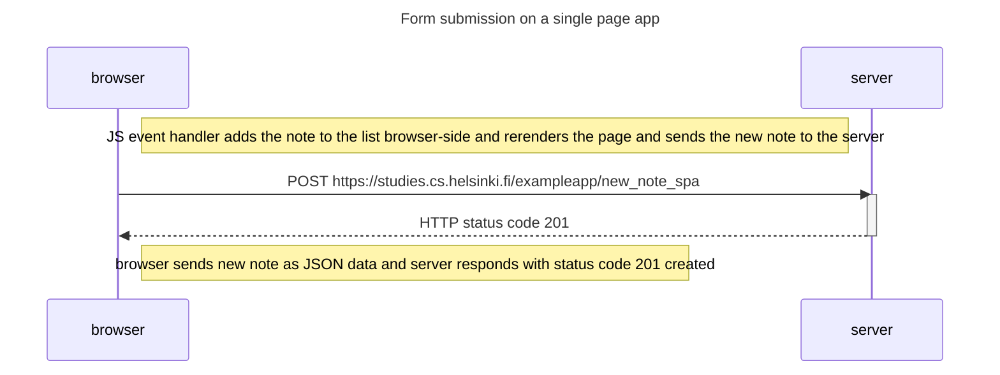

```mermaid
sequenceDiagram
    title Form submission on a single page app
    participant browser
    participant server

    Note right of browser: JS event handler adds the note to the list browser-side and rerenders the page and sends the new note to the server
    
    browser->>server: POST https://studies.cs.helsinki.fi/exampleapp/new_note_spa
    activate server
    server-->>browser: HTTP status code 201
    deactivate server
    
    Note right of browser: browser sends new note as JSON data and server responds with status code 201 created
    
```
